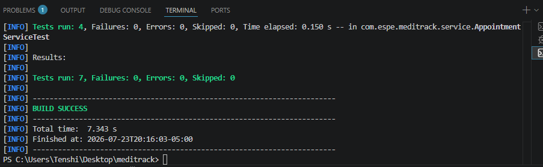
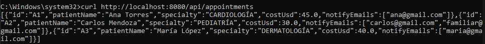
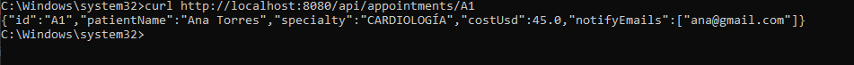

# Evidencias — MediTrack

**Universidad de las Fuerzas Armadas ESPE**  
**Asignatura:** Programación Avanzada  
**Proyecto:** MediTrack — Servicio Reactivo de Citas Médicas  
**Estudiante:** Martha Patricia Lapuerta Quinatoa  

---

## 1. Resultado de las pruebas unitarias

Las pruebas fueron ejecutadas con:

```powershell
.\mvnw.cmd clean test
```



---

## 2. Consulta de todas las citas válidas

Comando ejecutado:

```powershell
curl.exe http://localhost:8080/api/appointments
```



---

## 3. Consulta de una cita por identificador

Comando ejecutado:

```powershell
curl.exe http://localhost:8080/api/appointments/A1
```



---

## Conclusión

Las pruebas unitarias finalizaron correctamente y ambos endpoints reactivos fueron comprobados desde la terminal utilizando `curl`.
